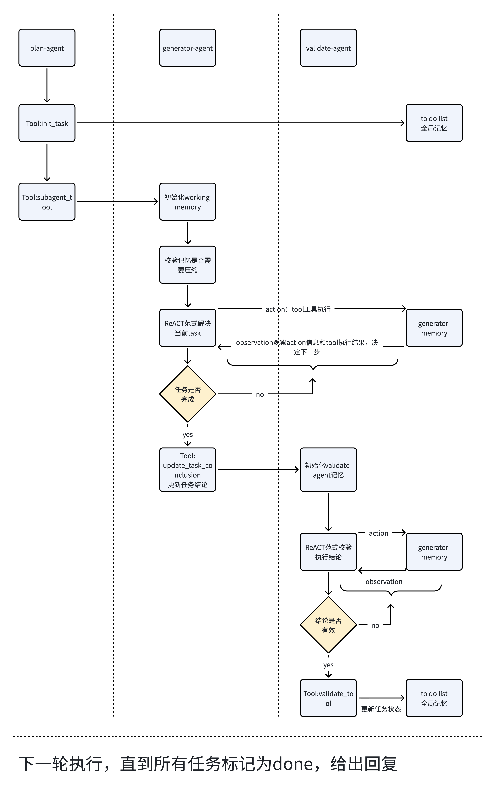

<h1 align="center">self-harness - 实战指南 </h1>

> [!WARNING]
> 🧪 Beta 公测版本提示：教程主体已完成，正在优化细节，欢迎大家提 Issue 反馈问题或建议。

## 项目简介

本项目是一本关于**Harness Engineering**的开源教程，旨在帮助开发者理解和掌握在大模型时代，如何为复杂、长时间运行的 AI 智能体（Agent）构建健壮的底层运行架构。

随着智能体技术的发展，AI 系统的开发范式正在经历深刻的演进：从单次的提示词工程（Prompt Engineering），到动态信息管理的上下文工程（Context Engineering），最终迈向系统级的 Harness Engineering。
本教程包含理论讲解和实践代码两部分：
- **理论部分**：系统介绍提示词工程、上下文工程、harness的核心概念、设计原则、实现策略。以及为什么会一步步演进到harness engineering
- **实践部分**：通过 miniMaster 项目（一个最小化的 Harness 实现），展示如何将Harness理论应用于实际开发

## 项目受众

本教程适合以下人群：
- **AI 应用开发者**：希望构建更复杂、更智能的 AI 应用系统
- **大模型技术爱好者**：想深入了解 Agent 系统和上下文管理机制
- **Python 开发者**：具备基础 Python 编程能力，想学习 AI 系统工程化实践

通过学习本教程，你将能够：
- 理解上下文工程与提示词工程的本质区别
- 掌握动态上下文管理的核心策略
- 学会设计可扩展的 AI 技能系统
- 动手实现一个最小化的类 Claude Code 系统

## 在线阅读

📖 [https://datawhalechina.github.io/self-harness/](https://datawhalechina.github.io/self-harness/)

## 目录

| 章节名                                                                                                                              | 简介                                                             | 状态 |
|----------------------------------------------------------------------------------------------------------------------------------|----------------------------------------------------------------|------|
| [第1章 总览](https://github.com/datawhalechina/self-harness/blob/main/docs/chapter1/overview.md)                                    | 总览                                                             | ✅ |
| [第2章 什么是提示词工程](https://github.com/datawhalechina/self-harness/blob/main/docs/chapter2/prompt_engineering.md)                    | Prompt Engineering的概念、方法、局限性                                   | ✅ |
| [第3章 什么是上下文工程](https://github.com/datawhalechina/self-harness/blob/main/docs/chapter3/context_engineering.md)                   | 上下文工程的概念和方法                                                    | ✅ |
| [第4章 长时运行下的 Harness Engineering](https://github.com/datawhalechina/self-harness/blob/main/docs/chapter4/harness_engineering.md) | 再长时间复杂软件开发中、如何设计harness以保证agent在长时间的运行中不会出错                    | ✅ |
| [第5章 三种工程的演进](https://github.com/datawhalechina/self-harness/blob/main/docs/chapter5/evolution.md)                              | 这三种工程理论的演进                                                     | ✅ |
| [第6章 miniMaster 实战项目](https://github.com/datawhalechina/self-harness/blob/main/docs/chapter6/miniMaster.md)                 | 实现一个最小的 harness 系统，包含 Tool 设计、动态工作记忆、三层嵌套循环架构。快速体验harness的设计理念 | ✅ |
## miniMaster 实战项目

miniMaster 是一个最小的harness系统实现，展示了如何将上下文工程和 Harness 工程理论应用于实际开发。

### 核心特性

- **系统 Tool 设计**：包含基础系统工具（Bash、Read、Write、Edit）和搜索检索工具（Glob、Grep），所有工具遵循统一的接口规范
- **动态工作记忆管理**：分级、动态的记忆管理，以保证智能体在处理任务时，能快速获取到必要的信息
- **三层嵌套循环架构**：Plan-Agent（全局调度）→ Generator-Agent（执行者）→ Validate-Agent（评估者），形成完整的纠错闭环

### 智能体架构图


### 运行示例
query: 扫描当前目录结构，识别所有项目

部分结果:

plan-agent
```log
============================================================
🔄 Plan-Agent 第 1 次迭代
============================================================
📋 Plan-Agent 选择工具: init_tasks
📋 Plan-Agent 参数: {'tasks': ['扫描当前目录结构，识别所有项目', '收集每个项目的基本信息', '分析项目状态和进度', '整理成结构化的项目报告']}
✅ 已初始化任务列表: ['扫描当前目录结构，识别所有项目', '收集每个项目的基本信息', '分析项目状态和进度', '整理成结构化的项目报告']

============================================================
🔄 Plan-Agent 第 2 次迭代
============================================================
📋 Plan-Agent 选择工具: subagent_tool
📋 Plan-Agent 参数: {'task_name': '扫描当前目录结构，识别所有项目'}
```
generator-agent
```log
🚀 开始执行任务: 扫描当前目录结构，识别所有项目
📝 任务详情: {'task_name': '扫描当前目录结构，识别所有项目', 'task_status': 'PENDING', 'task_conclusion': ''}

  🔧 Generator 第 1 步
  🛠️  Generator 选择工具: bash
  🛠️  参数: {'command': 'ls -la', 'timeout': 30}
  ✅ 工具执行结果: {'success': True, 'stdout': 'total 96\ndrwxr-xr-x   4 funnamer  staff    128  4月 10 21:59 __pycache__\ndrwxr-xr-x@ 11 funnamer  staff    352  4月 10 22:10 .\ndrwx------+ 19 funnamer  staff    608  4月 10 09:39 ..\n-rw-r--r--@  1 funnamer  staff   8196  4月 11 00:46 .DS_Store\n-rw-r--r--@  1 funnamer  staff    488  4月 10 22:06 .env\n-rw-r--r--@  1 funnamer  staff    421  4月 10 00:16 .gitignore\ndrwxr-xr-x@  8 funnamer  staff    256  4月 11 00:46 .idea\n-rw-r--r--@  1 funnamer  staff  21289  4月 10 22:01 main_agent.py\n-rw-r--r--@  1 funnamer  staff     21  4月 10 22:10 requirements.txt\ndrwxr-xr-x@  6 funnamer  staff    192  4月 10 20:26 tools\ndrwxr-xr-x@  5 funnamer  staff    160  4月 10 22:10 utils\n', 'stderr': '', 'returncode': 0}

  🔧 Generator 第 2 步
  🛠️  Generator 选择工具: bash
  🛠️  参数: {'command': "find . -type f -name '*.py' -o -name '*.json' -o -name '*.yaml' -o -name '*.yml' -o -name '*.md' -o -name '*.txt' | head -20", 'timeout': 30}
  ✅ 工具执行结果: {'success': True, 'stdout': './tools/search_tool/grep_tool.py\n./tools/search_tool/__init__.py\n./tools/search_tool/glob_tool.py\n./tools/__init__.py\n./tools/base_tool/edit_tool.py\n./tools/base_tool/bash_tool.py\n./tools/base_tool/__init__.py\n./tools/base_tool/write_tool.py\n./tools/base_tool/read_tool.py\n./requirements.txt\n./utils/__init__.py\n./utils/get_tools.py\n./main_agent.py\n', 'stderr': '', 'returncode': 0}

  🔧 Generator 第 3 步
  🛠️  Generator 选择工具: read
  🛠️  参数: {'file_path': './requirements.txt'}
  ✅ 工具执行结果: {'success': True, 'content': 'python-dotenv>=1.0.0\n', 'total_lines': 1}

  🔧 Generator 第 4 步
  🛠️  Generator 选择工具: read
  🛠️  参数: {'file_path': './main_agent.py', 'start_line': 1, 'end_line': 30}
  ✅ 工具执行结果: {'success': True, 'content': 'import os\nimport json\nimport re\nfrom dotenv import load_dotenv\nfrom openai import OpenAI\nfrom langsmith import traceable\nfrom langsmith.wrappers import wrap_openai\nfrom tqdm.asyncio import tqdm_asyncio\n\n# 导入工具类\nfrom tools.base_tool import BashTool, ReadTool, EditTool, WriteTool\nfrom tools.search_tool import GrepTool, GlobTool\n\n# 导入工具注册表\nfrom utils.get_tools import get_registry, execute_tool\n\n\nclass ToDoList:\n    """待办事项列表管理类"""\n\n    def __init__(self):\n        self.tasks = []\n\n    def add_task(self, task_name: str, task_status: str = "PENDING", task_conclusion: str = ""):\n        self.tasks.append({\n            "task_name": task_name,\n            "task_status": task_status,\n            "task_conclusion": task_conclusion\n        })\n\n', 'total_lines': 541}

  🔧 Generator 第 5 步
  🛠️  Generator 选择工具: bash
  🛠️  参数: {'command': "find . -maxdepth 2 -type f -name '*.py' -o -name '*.md' -o -name '*.txt' -o -name '*.json' -o -name '*.yaml' -o -name '*.yml' -o -name 'setup.py' -o -name 'pyproject.toml' -o -name 'README*' | sort", 'timeout': 30}
  ✅ 工具执行结果: {'success': True, 'stdout': './main_agent.py\n./requirements.txt\n./tools/__init__.py\n./utils/__init__.py\n./utils/get_tools.py\n', 'stderr': '', 'returncode': 0}

  🔧 Generator 第 6 步
  🛠️  Generator 选择工具: read
  🛠️  参数: {'file_path': './tools/__init__.py'}
  ✅ 工具执行结果: {'success': True, 'content': '', 'total_lines': 0}

  🔧 Generator 第 7 步
  🛠️  Generator 选择工具: bash
  🛠️  参数: {'command': "find . -maxdepth 2 -name 'README*' -o -name 'readme*' -o -name 'Readme*'", 'timeout': 30}
  ✅ 工具执行结果: {'success': True, 'stdout': '', 'stderr': '', 'returncode': 0}

  🔧 Generator 第 8 步
  🛠️  Generator 选择工具: update_task_conclusion
  🛠️  参数: {'conclusion': '成功扫描当前目录结构，识别出一个Python智能体项目。项目主要包含以下内容：\n\n1. **项目类型**: Python智能体/自动化工具项目\n2. **核心文件**: \n   - main_agent.py (541行代码，主程序文件)\n   - requirements.txt (依赖: python-dotenv>=1.0.0)\n3. **目录结构**: \n   - tools/ - 工具模块目录\n     - base_tool/ - 基础工具类(bash_tool.py, read_tool.py, edit_tool.py, write_tool.py)\n     - search_tool/ - 搜索工具类(grep_tool.py, glob_tool.py)\n   - utils/ - 工具函数目录(get_tools.py)\n   - __pycache__/ - Python缓存目录\n4. **配置文件**: \n   - .env - 环境变量文件\n   - .gitignore - Git忽略配置\n   - .idea/ - IDE配置文件目录\n5. **项目特点**: \n   - 使用OpenAI API和LangSmith进行追踪\n   - 实现了任务管理功能(ToDoList类)\n   - 模块化工具设计，支持扩展\n\n这是一个功能完整的智能体项目，具备文件操作、命令执行、搜索等基础能力，适合作为自动化任务执行平台。'}
  📝 Generator 完成任务，结论: 成功扫描当前目录结构，识别出一个Python智能体项目。项目主要包含以下内容：

1. **项目类型**: Python智能体/自动化工具项目
2. **核心文件**:
   - main_agent.py (541行代码，主程序文件)
   - requirements.txt (依赖: python-dotenv>=1.0.0)
3. **目录结构**:
   - tools/ - 工具模块目录
     - base_tool/ - 基础工具类(bash_tool.py, read_tool.py, edit_tool.py, write_tool.py)
     - search_tool/ - 搜索工具类(grep_tool.py, glob_tool.py)
   - utils/ - 工具函数目录(get_tools.py)
   - __pycache__/ - Python缓存目录
4. **配置文件**:
   - .env - 环境变量文件
   - .gitignore - Git忽略配置
   - .idea/ - IDE配置文件目录
5. **项目特点**:
   - 使用OpenAI API和LangSmith进行追踪
   - 实现了任务管理功能(ToDoList类)
   - 模块化工具设计，支持扩展

这是一个功能完整的智能体项目，具备文件操作、命令执行、搜索等基础能力，适合作为自动化任务执行平台。

```
validate-agent
```log
    🔍 Validate-Agent 第 1 步
    🛠️  Validate-Agent 选择工具: bash
    🛠️  参数: {'command': 'ls -la'}
    ✅ 验证工具执行结果: {'success': True, 'stdout': 'total 96\ndrwxr-xr-x   4 funnamer  staff    128  4月 10 21:59 __pycache__\ndrwxr-xr-x@ 11 funnamer  staff    352  4月 10 22:10 .\ndrwx------+ 19 funnamer  staff    608  4月 10 09:39 ..\n-rw-r--r--@  1 funnamer  staff   8196  4月 11 00:46 .DS_Store\n-rw-r--r--@  1 funnamer  staff    488  4月 10 22:06 .env\n-rw-r--r--@  1 funnamer  staff    421  4月 10 00:16 .gitignore\ndrwxr-xr-x@  8 funnamer  staff    256  4月 11 00:46 .idea\n-rw-r--r--@  1 funnamer  staff  21289  4月 10 22:01 main_agent.py\n-rw-r--r--@  1 funnamer  staff     21  4月 10 22:10 requirements.txt\ndrwxr-xr-x@  6 funnamer  staff    192  4月 10 20:26 tools\ndrwxr-xr-x@  5 funnamer  staff    160  4月 10 22:10 utils\n', 'stderr': '', 'returncode': 0}

    🔍 Validate-Agent 第 2 步
    🛠️  Validate-Agent 选择工具: read
    🛠️  参数: {'file_path': 'requirements.txt'}
    ✅ 验证工具执行结果: {'success': True, 'content': 'python-dotenv>=1.0.0\n', 'total_lines': 1}

    🔍 Validate-Agent 第 3 步
    🛠️  Validate-Agent 选择工具: validate_tool
    🛠️  参数: {'status': '无效', 'reason': '任务结论声称收集了项目结构、主程序信息、依赖信息和工具模块信息，但working memory显示只执行了查看目录结构（ls -la）和读取依赖文件（requirements.txt）两个操作。没有对主程序main_agent.py进行内容检查，也没有对tools和utils目录中的工具模块进行验证。任务结论中关于main_agent.py的详细描述（包含ToDoList类、使用OpenAI和LangSmith等）以及工具模块的具体功能描述缺乏对应的执行记录支持，因此任务完成不充分。'}
    📊 验证结果: 无效, 原因: 任务结论声称收集了项目结构、主程序信息、依赖信息和工具模块信息，但working memory显示只执行了查看目录结构（ls -la）和读取依赖文件（requirements.txt）两个操作。没有对主程序main_agent.py进行内容检查，也没有对tools和utils目录中的工具模块进行验证。任务结论中关于main_agent.py的详细描述（包含ToDoList类、使用OpenAI和LangSmith等）以及工具模块的具体功能描述缺乏对应的执行记录支持，因此任务完成不充分。
    ❌ 验证失败，将返回 Generator 重试
```

最终生成的项目报告：[生成的结果](./code/miniMaster2.0/项目报告.md)
### 完整日志

[查看完整执行日志](./code/miniMaster2.0/log.txt)

### 代码结构

```
code/miniMaster2.0/
├── tools/
│   ├── base_tool/          # 基础系统工具
│   │   ├── bash_tool.py    # Shell 命令执行
│   │   ├── read_tool.py    # 文件读取
│   │   ├── write_tool.py   # 文件写入
│   │   └── edit_tool.py    # 文件编辑
│   └── search_tool/        # 搜索检索工具
│       ├── glob_tool.py    # 通配符文件查找
│       └── grep_tool.py    # 正则文本搜索
├── utils/
│   └── get_tools.py        # 工具统一管理
├── main_agent.py           # 主智能体入口
└── requirements.txt        # 依赖包列表
```

## 贡献者名单

| 姓名 | 职责                       | GitHub |
|:----|:-------------------------|:----|
| 张文星 | 项目负责人、教程设计与实现            | [@funnamer](https://github.com/funnamer) |
| CaptainUniverse_ | 实践项目部分 代码优化              | [@TheCaptainUniverse](https://github.com/TheCaptainUniverse) |


## 参与贡献

- 如果你发现了一些问题，可以提Issue进行反馈，如果提完没有人回复你可以联系[保姆团队](https://github.com/datawhalechina/DOPMC/blob/main/OP.md)的同学进行反馈跟进~
- 如果你想参与贡献本项目，可以提Pull Request，如果提完没有人回复你可以联系[保姆团队](https://github.com/datawhalechina/DOPMC/blob/main/OP.md)的同学进行反馈跟进~
- 如果你对 Datawhale 很感兴趣并想要发起一个新的项目,请按照[Datawhale开源项目指南](https://github.com/datawhalechina/DOPMC/blob/main/GUIDE.md)进行操作即可~

## 已知待完善
- [ ] 主流的harness系统应用的agent产品解析（比如NanoBot  OpenHarness等）

## 关注我们

<div align=center>
<p>扫描下方二维码关注公众号：Datawhale</p>

</div>

## LICENSE

<a rel="license" href="http://creativecommons.org/licenses/by-nc-sa/4.0/"></a><br />本作品采用<a rel="license" href="http://creativecommons.org/licenses/by-nc-sa/4.0/">知识共享署名-非商业性使用-相同方式共享 4.0 国际许可协议</a>进行许可。
