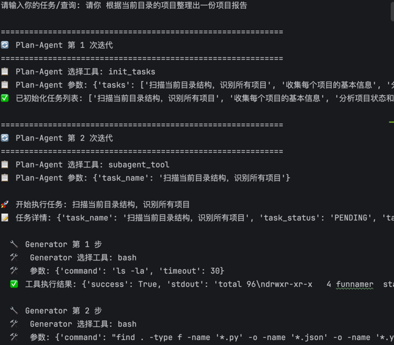

<h1 align="center">self-harness - 实战指南 </h1>

> [!WARNING]
> 🧪 Beta 公测版本提示：教程主体已完成，正在优化细节，欢迎大家提 Issue 反馈问题或建议。

## 项目简介

本项目是一本关于**Harness Engineering**的开源教程，旨在帮助开发者理解和掌握在大模型时代，如何为复杂、长时间运行的 AI 智能体（Agent）构建健壮的底层运行架构。

随着智能体技术的发展，AI 系统的开发范式正在经历深刻的演进：从单次的提示词工程（Prompt Engineering），到动态信息管理的上下文工程（Context Engineering），最终迈向系统级的 Harness Engineering。
本教程包含理论讲解和实践代码两部分：
- **理论部分**：系统介绍提示词工程、上下文工程、harness的核心概念、设计原则、实现策略。以及为什么会一步步演进到harness engineering
- **实践部分**：通过 miniMaster 项目（一个最小化的 Harness 实现），展示如何将Harness理论应用于实际开发

## 项目受众

本教程适合以下人群：
- **AI 应用开发者**：希望构建更复杂、更智能的 AI 应用系统
- **大模型技术爱好者**：想深入了解 Agent 系统和上下文管理机制
- **Python 开发者**：具备基础 Python 编程能力，想学习 AI 系统工程化实践

通过学习本教程，你将能够：
- 理解上下文工程与提示词工程的本质区别
- 掌握动态上下文管理的核心策略
- 学会设计可扩展的 AI 技能系统
- 动手实现一个最小化的类 Claude Code 系统

## 在线阅读

📖 [https://datawhalechina.github.io/dive-into-context-engineering/](https://datawhalechina.github.io/dive-into-context-engineering/)

## 目录

| 章节名                                                                                                                              | 简介                                                             | 状态 |
|----------------------------------------------------------------------------------------------------------------------------------|----------------------------------------------------------------|------|
| [第1章 总览](https://github.com/datawhalechina/repo-template/blob/main/docs/chapter1/overview.md)                                    | 总览                                                             | ✅ |
| [第2章 什么是提示词工程](https://github.com/datawhalechina/repo-template/blob/main/docs/chapter2/prompt_engineering.md)                    | Prompt Engineering的概念、方法、局限性                                   | ✅ |
| [第3章 什么是上下文工程](https://github.com/datawhalechina/repo-template/blob/main/docs/chapter3/context_engineering.md)                   | 上下文工程的概念和方法                                                    | ✅ |
| [第4章 长时运行下的 Harness Engineering](https://github.com/datawhalechina/repo-template/blob/main/docs/chapter4/harness_engineering.md) | 再长时间复杂软件开发中、如何设计harness以保证agent在长时间的运行中不会出错                    | ✅ |
| [第5章 三种工程的演进](https://github.com/datawhalechina/repo-template/blob/main/docs/chapter5/evolution.md)                              | 这三种工程理论的演进                                                     | ✅ |
| [第6章 miniMaster 实战项目](https://github.com/datawhalechina/repo-template/blob/main/docs/chapter6/miniMaster.md)                 | 实现一个最小的 harness 系统，包含 Tool 设计、动态工作记忆、三层嵌套循环架构。快速体验harness的设计理念 | ✅ |
## miniMaster 实战项目

miniMaster 是一个最小的harness系统实现，展示了如何将上下文工程和 Harness 工程理论应用于实际开发。

### 核心特性

- **系统 Tool 设计**：包含基础系统工具（Bash、Read、Write、Edit）和搜索检索工具（Glob、Grep），所有工具遵循统一的接口规范
- **动态工作记忆管理**：分级、动态的记忆管理，以保证智能体在处理任务时，能快速获取到必要的信息
- **三层嵌套循环架构**：Plan-Agent（全局调度）→ Generator-Agent（执行者）→ Validate-Agent（评估者），形成完整的纠错闭环

### 运行示例


[生成的结果](./code/miniMaster2.0/项目报告.md)
### 完整日志

[查看完整执行日志](./code/miniMaster2.0/log.txt)

### 代码结构

```
code/miniMaster2.0/
├── tools/
│   ├── base_tool/          # 基础系统工具
│   │   ├── bash_tool.py    # Shell 命令执行
│   │   ├── read_tool.py    # 文件读取
│   │   ├── write_tool.py   # 文件写入
│   │   └── edit_tool.py    # 文件编辑
│   └── search_tool/        # 搜索检索工具
│       ├── glob_tool.py    # 通配符文件查找
│       └── grep_tool.py    # 正则文本搜索
├── utils/
│   └── get_tools.py        # 工具统一管理
├── main_agent.py           # 主智能体入口
└── requirements.txt        # 依赖包列表
```

## 贡献者名单

| 姓名 | 职责 | GitHub |
|:----|:----|:----|
| 张文星 | 项目负责人、教程设计与实现 | [@funnamer](https://github.com/funnamer) |


## 参与贡献

- 如果你发现了一些问题，可以提Issue进行反馈，如果提完没有人回复你可以联系[保姆团队](https://github.com/datawhalechina/DOPMC/blob/main/OP.md)的同学进行反馈跟进~
- 如果你想参与贡献本项目，可以提Pull Request，如果提完没有人回复你可以联系[保姆团队](https://github.com/datawhalechina/DOPMC/blob/main/OP.md)的同学进行反馈跟进~
- 如果你对 Datawhale 很感兴趣并想要发起一个新的项目，请按照[Datawhale开源项目指南](https://github.com/datawhalechina/DOPMC/blob/main/GUIDE.md)进行操作即可~

## 关注我们

<div align=center>
<p>扫描下方二维码关注公众号：Datawhale</p>

</div>

## LICENSE

<a rel="license" href="http://creativecommons.org/licenses/by-nc-sa/4.0/"></a><br />本作品采用<a rel="license" href="http://creativecommons.org/licenses/by-nc-sa/4.0/">知识共享署名-非商业性使用-相同方式共享 4.0 国际许可协议</a>进行许可。
